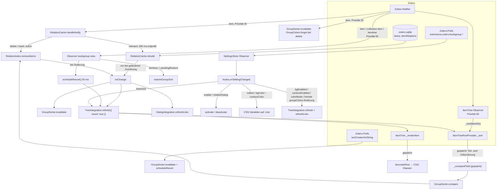
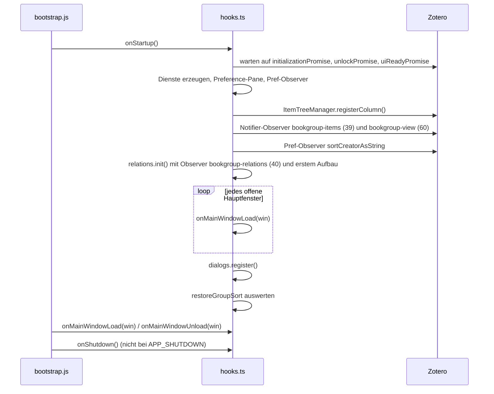

# Architektur

Dieses Dokument beschreibt den Aufbau des Plugins **Book Group** (`bookgroup@justanotherjurastudent.github.io`) für Zotero 10: welche Komponenten es gibt, wie Daten zwischen ihnen fließen, wie das Plugin in den Lebenszyklus von Zotero eingebunden ist und warum die Implementierung so aussieht, wie sie aussieht.

Für die Programmierschnittstellen siehe [api.md](api.md), für die Bedienung [user-guide.md](user-guide.md).

## Überblick

Book Group zeigt Buchteile (`bookSection`) und Enzyklopädieartikel (`encyclopediaArticle`) direkt unter dem Sammelwerk (`book`) an, mit dem sie über „Verwandt“ (Zotero-Relation `dc:relation`) verknüpft sind. Beiträge werden in der ersten Spalte eingerückt, Sammelwerke optional farbig hinterlegt und die Gruppe mit einer Konturlinie markiert.

Grundprinzipien:

- **Keine Datenänderung.** Das Plugin schreibt nichts in Einträge oder Relationen. Es liest die Relationen, sortiert die Ansicht um und dekoriert Zeilen. Sync und Export bleiben unberührt.
- **Gruppierung ist eine Sortierung.** Die Gruppierung ist genau dann aktiv, wenn eine Eintragsliste nach der plugin-eigenen Spalte „Sammelwerk“ sortiert ist. Ein Klick auf eine andere Spalte beendet sie.
- **Jede Einstellung wirkt sofort**, ohne Neustart.

Der Code gliedert sich in diese Bereiche:

| Bereich                | Verzeichnis                                                          | Eigenschaften                                                                                                                         |
| ---------------------- | -------------------------------------------------------------------- | ------------------------------------------------------------------------------------------------------------------------------------- |
| Reine Logik            | `src/modules/core/`                                                  | Keine Zotero-API-Aufrufe, in Node mit `npm run test:unit` testbar                                                                     |
| Zotero-Integration     | `src/modules/*.ts`                                                   | Datenbankzugriff, Notifier, Preferences, Patches an Zotero-Interna, DOM                                                               |
| Einstieg und Lifecycle | `src/index.ts`, `src/addon.ts`, `src/hooks.ts`, `addon/bootstrap.js` | Plugin-Instanz `Zotero.BookGroup`, Verdrahtung aller Dienste                                                                          |
| Ressourcen             | `addon/`                                                             | `prefs.js`, `content/preferences.xhtml`, `content/preferences.css`, `content/bookgroup.css`, `content/icons/`, `locale/{de-DE,en-US}` |

## Komponenten

Alle Dienste werden in `hooks.onStartup()` genau einmal erzeugt und in `addon.data.services` (Typ `BookGroupServices`) abgelegt. Dort liegen außerdem die IDs aller in `hooks.ts` angemeldeten Observer (`observerIDs`, `prefObserverIDs`) und das Flag `pendingRestore`.

```mermaid
flowchart LR
  settings[SettingsStore]
  cache[RelationCache]
  index[RelationIndex]
  sorter[GroupSorter]
  colors[GroupColors]
  trees[TreeIntegration]
  dialogs[DialogIntegration]
  menu[ViewMenu]
  column[Spalte groupSortKey]

  cache --> index
  sorter --> cache
  sorter --> settings
  trees --> settings
  trees --> sorter
  trees --> colors
  dialogs --> trees
  dialogs --> sorter
  dialogs --> cache
  dialogs --> settings
  dialogs --> colors
  menu --> trees
  menu --> settings
  column --> sorter
```

### SettingsStore (`src/modules/settings.ts`)

Zwischengespeicherte, validierte Sicht auf die Preferences unter `extensions.zotero.bookgroup.*`.

- `current` liest die Werte beim ersten Zugriff und hält sie im Speicher. Das ist wichtig, weil Rendering-Code die Einstellungen für jede sichtbare Zeile abfragt.
- `register()` legt für jeden Nutzer-Schlüssel und für `groupColors` einen `Zotero.Prefs.registerObserver` an. Ändert sich ein Wert, wird der Cache verworfen und alle `onChange`-Listener werden mit dem Schlüssel aufgerufen.
- Ungültige Werte fallen auf Defaults zurück (z. B. Farben, die nicht `#rrggbb` sind, oder `indent` außerhalb von 0–64).
- `getRaw()`/`setRaw()` greifen ohne Validierung zu; sie werden für `groupColors` und den internen Schlüssel `restoreGroupSort` verwendet. `restoreGroupSort` wird nicht beobachtet.

### RelationCache und RelationIndex

`RelationIndex` (`src/modules/core/relationIndex.ts`) ist eine reine In-Memory-Struktur mit O(1)-Zugriff in beide Richtungen:

- `childToParent: Map<contributionID, containerID>`
- `parentToChildren: Map<containerID, contributionID[]>` (aufsteigend nach Item-ID sortiert)

Ist ein Beitrag mit mehreren Sammelwerken verknüpft, wird das Sammelwerk gewählt, dessen Metadaten zum Beitrag passen (siehe [Auswahl bei mehreren Sammelwerken](#auswahl-bei-mehreren-sammelwerken)):

1. Der Buchtitel des Beitrags (`bookTitle` bzw. `encyclopediaTitle`) stimmt mit dem Titel des Sammelwerks überein, **und** mindestens ein Herausgeber kommt in beiden Einträgen vor.
2. Passt kein Sammelwerk (oder passen mehrere), entscheidet unter den verbleibenden Kandidaten die **kleinste Item-ID**.

Das Ergebnis ist damit deterministisch und unabhängig von der Reihenfolge der Datenbankzeilen. `rebuild()` meldet zurück, ob sich eine Zuordnung Beitrag → Sammelwerk geändert hat.

`resolveLinks()` leitet aus Kandidaten-Items und Relationszeilen die Verknüpfungen ab. Es zählt nur eine direkte Relation zwischen einem Container (`book`) und einem Beitrag (`bookSection`/`encyclopediaArticle`) **derselben Bibliothek**. Die Relation darf auf einer der beiden Seiten gespeichert sein; Duplikate werden zusammengefasst.

`RelationCache` (`src/modules/relationCache.ts`) hält den Index mit der Datenbank synchron:

- **Laden** per SQL: alle nicht gelöschten Items der Gruppierungstypen (`items`, ohne `deletedItems`) und alle `dc:relation`-Zeilen dieser Items (`itemRelations` ⨝ `relationPredicates` ⨝ `items`). Objekt-URIs werden mit `Zotero.URI.getURIItemLibraryKey()` in Bibliothek und Key zerlegt, genau wie Zotero es in `Item.prototype._getRelatedItems()` tut.
- **Metadaten bei Mehrdeutigkeit:** Nur für Beiträge mit mehreren Sammelwerken (`findAmbiguousContributions`) lädt `loadVolumeMetadata()` Titel und Herausgeber über die Item-API (`Zotero.Items.getAsync` und `loadDataTypes(["itemData", "creators"])`). Beim Beitrag wird der Buchtitel über das Basisfeld `publicationTitle` gelesen, das in Zotero auf `bookTitle` bzw. `encyclopediaTitle` abgebildet ist. `markMetadataMatches()` markiert daraufhin die passenden Verknüpfungen.
- **Notifier-Observer** `bookgroup-relations` auf Typ `item` mit Priorität 40:
    - `delete`: IDs werden sofort aus dem Index entfernt; bei Änderung werden Listener benachrichtigt. Zusätzlich wird ein Löschzähler erhöht.
    - `trash`: Ist eine betroffene ID relevant, werden die IDs sofort entfernt, danach wird ein Rebuild geplant.
    - alle anderen Ereignisse (`add`, `modify`, `refresh`, …): Rebuild wird geplant, wenn eine der IDs im Index steht oder ein Item eines Gruppierungstyps ist.
- **Rebuild** ist ein vollständiger Neuaufbau, entprellt über `REBUILD_DELAY` = 300 ms.
    - Parallele Aufrufe werden zusammengelegt: Ein Aufruf während eines laufenden Aufbaus plant genau einen Folgeaufbau.
    - Wurde während des Ladens ein Item gelöscht (Löschzähler hat sich geändert), wird das Ergebnis verworfen und neu geladen.
    - Listener werden **nur benachrichtigt, wenn sich eine Zuordnung geändert hat**. Reine Feldänderungen (Titel, Datum, Seiten) behandelt der Sortier-Patch über vollständige Sortierungen.
    - Die Dauer wird als `Relation cache: N links in X ms` protokolliert.
- `isPending` ist `true`, solange ein Rebuild geplant ist oder läuft (von Tests verwendet).

`src/modules/itemTypes.ts` bildet `itemTypeID` auf „container“ (`book`) oder „contribution“ (`bookSection`, `encyclopediaArticle`) ab. Zotero kennt keinen eigenen Eintragstyp für Enzyklopädien; sie werden als Buch erfasst, deshalb gruppieren sich Enzyklopädieartikel unter Büchern. `safeGetItem()` kapselt `Zotero.Items.get()`, das für nicht geladene Items eine `UnloadedDataException` auslöst. Sortier- und Render-Code darf keine Ausnahmen auslösen, daher liefert `safeGetItem()` in diesem Fall `null`.

### GroupSorter (`src/modules/groupSorter.ts`)

Berechnet die gruppierte Reihenfolge. Die eigentliche Vergleichslogik liegt rein funktional in `src/modules/core/groupOrder.ts`.

**Jedes `Zotero.Item`** erhält einen `GroupEntry`, auch eigenständige Notizen und Anhänge. Nur reguläre Einträge können einem Sammelwerk untergeordnet werden:

| Feld        | Sammelwerk, allein stehendes Item, Notiz, Anhang | Regulärer Beitrag mit sichtbarem Sammelwerk |
| ----------- | ------------------------------------------------ | ------------------------------------------- |
| `rootID`    | eigene ID                                        | ID des Sammelwerks                          |
| `rootKey`   | eigener Basisschlüssel                           | Basisschlüssel des Sammelwerks              |
| `rank`      | `0`                                              | `1`                                         |
| `pageStart` | `null`                                           | erste Seite aus dem Feld `pages`            |
| `title`     | Sortiertitel                                     | Sortiertitel                                |

Zeilen, die keine Items sind (Sammlungen und gespeicherte Suchen im Papierkorb), erhalten keinen Eintrag. Beim Vergleich eines Items mit einer solchen Zeile liefert `GroupSorter.compare()` einen festen Wert: Nicht-Item-Zeilen bilden einen geschlossenen Block, der bei aufsteigender Sortierung vor und bei absteigender Sortierung hinter den Items steht. Nur zwei Nicht-Item-Zeilen werden untereinander nach Titel verglichen. Dadurch gilt für alle Paare dieselbe Ordnung, und die Vergleichsfunktion ist transitiv.

Der Basisschlüssel ist je nach Einstellung `baseSort` entweder `[creator, year, title]` oder `[title, creator, year]`. Er wird so gebildet wie in Zoteros `ItemTreeRowProvider`: Ersteller aus `sortCreator` bzw. `firstCreator` (abhängig von Zoteros Pref `sortCreatorAsString`), Jahr aus den ersten vier Zeichen des Multipart-Datums, Titel über `Zotero.Items.getSortTitle()`.

Vergleichsregeln (`compareGroupEntries`):

1. Basisschlüssel komponentenweise; leere Komponenten stehen hinten.
2. Bei gleichem Schlüssel: `rootID`, damit zwei gleich benannte Sammelwerke nicht vermischt werden.
3. Innerhalb der Gruppe (`compareWithinGroup`): Rang (Sammelwerk zuerst), erste Seite (Einträge ohne Seiten hinten, römische Seitenzahlen vor arabischen), Titel, ID.

Die erste Seite liefert `parsePageStart()`:

- Eine ausdrückliche Seitenmarke (`S.`, `p.`, `pp.`, `Seite(n)`, `page(s)`) hat Vorrang: `"Bd. 2, S. 45"` → 45, `"vol. 3, pp. 17–30"` → 17.
- Sonst zählt die erste arabische Zahl bzw. eine vorangehende römische Zahl. Einzelne Buchstaben gelten nur bei `i`, `v` und `x` als römische Zahl: `"c. 12"` → 12.

Basisschlüssel werden über Sortierdurchläufe hinweg zwischengespeichert und mit `invalidate()` verworfen: bei jeder Item-Notifier-Meldung, bei jeder Änderung einer Zuordnung, bei Änderung von `baseSort` und bei Änderung von Zoteros Pref `sortCreatorAsString`.

`describe()` liefert den Text der Spalte „Sammelwerk“: für Beiträge `Titel des Sammelwerks › S. 12-34` (bzw. nur den Titel ohne Seiten), für Sammelwerke den eigenen Titel, sonst eine leere Zeichenkette.

### GroupColors (`src/modules/groupColors.ts`)

Vergibt im Farbmodus „random“ je Sammelwerk eine zufällige, lesbare Farbe (HSL: Farbton 0–359°, Sättigung 55–74 %, Helligkeit 45–56 %). Die Farben liegen als JSON in der Pref `groupColors`, geschlüsselt nach `libraryID/itemKey`. Diese Schlüssel sind im Gegensatz zu Item-IDs über Neustarts und Sync stabil.

- Neue Farben werden nach 250 ms gespeichert. Die Verzögerung ist kurz, weil `onShutdown()` beim Beenden von Zotero nicht läuft. Zusätzlich schreibt `flush()` beim Entladen jedes Hauptfensters und beim Shutdown sofort.
- Beim Löschen von Einträgen entfernt `forget()` die zugehörigen Farben.
- `reset()` leert die Tabelle und speichert sofort; beim nächsten Rendern entstehen neue Farben.
- `onPreferenceChanged()` erkennt eigene Schreibvorgänge (Flag `writing`) und gibt dann `false` zurück, sodass `hooks.ts` nicht unnötig neu rendert.

### TreeIntegration (`src/modules/treeIntegration.ts`)

Kern der Darstellung. Patcht pro Fenster drei Methoden der Zotero-Klassen aus `zotero/itemTree` und optional eine vierte für das Kontextmenü:

- **`ItemTreeRowProvider.prototype._compareField(a, b, sortField)`**: Ist `sortField` der Schlüssel der Plugin-Spalte und die Gruppierung für diesen Baum erlaubt (`isTreeActive`), vergleicht der Patch über `GroupSorter.compare()` (siehe [Sortierrichtung](#sortierrichtung)). Liefert der Sorter `null` (zwei Nicht-Item-Zeilen), wird nach Titel verglichen. Tritt im Vergleich eine Ausnahme auf (etwa weil ein Eintrag unerwartet nicht geladen ist), wird sie mit `Zotero.logError` protokolliert und das Zeilenpaar als gleichrangig behandelt (`0`); die Sortierung bricht dadurch nicht ab. In allen anderen Fällen wird das Original aufgerufen.
- **`ItemTreeRowProvider.prototype._sort(itemIDs)`**: Zotero sortiert nach Feldänderungen oder beim Filtern nur die betroffenen Zeilen neu (`_sort(itemIDs)`). Ist der Baum aktiv und nach der Gruppierungsspalte sortiert, macht der Patch daraus eine vollständige Sortierung (`itemIDs = null`).
- **`ItemTree.prototype._renderItem(index, selection, oldDiv, columns)`**: ruft das Original auf und setzt danach die CSS-Klassen der zurückgegebenen Zeile. Weil Zotero Zeilen-`div`s wiederverwendet, werden die Klassen bei jedem Aufruf zuerst entfernt.
- **`ItemTree.prototype.buildColumnPickerMenu(menupopup)`** (optional): baut das Kontextmenü der Spaltenüberschrift. Nach dem Original fügt `addColumnPickerEntry()` den Checkbox-Eintrag „Nach Sammelwerk gruppieren“ (ID `bookgroup-column-picker-sort`) direkt vor dem Untermenü für die sekundäre Sortierung (`anonid="zotero-column-picker-sort-menu"`) ein. Das geschieht nur im Popup mit der ID `zotero-column-picker`, das `_displayColumnPickerMenu()` bei jedem Rechtsklick neu erzeugt, und nur für aktive Bäume. **Ansicht → Spalten** im Hauptfenster nutzt dieselbe Methode mit einem anderen Popup und bleibt unverändert, weil **Ansicht → Sortieren nach** den Eintrag bereits anbietet. Fehlt die Methode, entfällt nur dieser Menüeintrag.

Weitere Aufgaben:

- `getTrees(win)` findet die Eintragslisten eines Fensters: `ZoteroPane.itemsView` (Hauptfenster), `libraryLayout.itemsView` (Zitationsdialog) und `itemsView` (Literaturverzeichnis-Dialog).
- `isTreeActive(tree)`: `enable` ist an, und der Baum ist entweder der Hauptbaum (ID `main`) oder ein Dialog-Baum bei eingeschalteter Option `citationDialog`.
- `isDialogTree(tree)` prüft die Baum-ID gegen `DIALOG_TREE_IDS` (`citationDialog`, `select-items-dialog`, `edit-bib-select-item-dialog`) **und** die URL des Fensters gegen `DIALOG_URLS`. Das Ergebnis wird pro Baum zwischengespeichert. Der Grund steht unter [Erkennung der Dialog-Bäume](#erkennung-der-dialog-bäume).
- `isGroupSorted(tree)` vergleicht `getSortField()` mit dem Spaltenschlüssel. `CollectionViewItemTree.getSortField()` löst eine Ausnahme aus, solange noch keine Spalten existieren (kurz nach dem Öffnen einer Ansicht); in diesem Fall gilt der Baum als nicht gruppiert.
- `activate()`/`deactivate()` schalten die Sortierung über `Columns.toggleSort(index)` der virtualisierten Tabelle um, also über denselben Weg wie ein Klick auf den Spaltenkopf. `deactivate()` sortiert nach `title`. Beide geben zurück, ob der Baum danach tatsächlich nach der gewünschten Spalte sortiert ist.
- `refresh({ resort })` rendert alle Bäume neu. Mit `resort: true` wird bei gruppierten Bäumen zusätzlich der Row-Cache verworfen (der Spaltentext hängt von den Relationen ab) und vollständig neu sortiert.
- `scheduleResort()` fasst mehrere Anfragen innerhalb von `RESORT_DELAY` = 50 ms zu einem `refresh({ resort: true })` zusammen.
- `destroy()` setzt ein `destroyed`-Flag, bricht einen geplanten Resort ab, löst alle Fenster und setzt `columnKey` auf `null`. Danach laufen keine verzögerten Aktionen mehr.
- Zeilenrollen bei der Dekoration (`decorateRow`):
    - `child`: der Beitrag sowie dessen Anhänge und Notizen, wenn das Sammelwerk in derselben Ansicht sichtbar ist → Einrückung und Kontur.
    - `parent`: das Sammelwerk (Ebene 0), wenn mindestens ein Beitrag sichtbar ist → Hintergrund und Kontur.
    - `member`: Anhänge und Notizen des Sammelwerks → nur Kontur.
- Dialog-Bäume werden beim ersten Rendern einmalig per `setTimeout` auf die Gruppierungsspalte umgeschaltet (`maybeAutoActivate`), weil ihre Initialisierung asynchron nach dem `load`-Ereignis erfolgt. Der Hauptbaum wird nie automatisch umgeschaltet.

Innerhalb eines Sortierdurchlaufs werden `GroupEntry`-Objekte pro Item zwischengespeichert. Als Kennung des Durchlaufs dient das Objekt `_sortCache`, das Zotero in `_initSortState()` für jeden Durchlauf neu anlegt.

### Sortierspalte (`src/modules/column.ts`)

`registerGroupColumn()` registriert über `Zotero.ItemTreeManager.registerColumn()` die Spalte mit `dataKey: "groupSortKey"` und der Beschriftung „Sammelwerk“/„Edited Volume“. Sie gilt für die Bäume `main`, `citationDialog`, `select-items-dialog` und `edit-bib-select-item-dialog`. Die Spalte erscheint im Spaltenwähler unter „Weitere Spalten“ und ist standardmäßig ausgeblendet. Zotero vergibt einen namespaced Schlüssel, der in `TreeIntegration.columnKey` gespeichert wird.

### Menüeinträge (`src/modules/viewMenu.ts`, `src/modules/groupSortMenu.ts`)

`groupSortMenu.ts` erzeugt den gemeinsamen Checkbox-Eintrag für beide Menüs (`createGroupSortMenuItem`): Häkchen, wenn der Baum gruppiert ist; ein Klick ruft `activate()` bzw. `deactivate()` auf. Alle eingefügten Elemente tragen die Klasse `bookgroup-menu`.

#### ViewMenu

Ergänzt im Hauptfenster das Menü **Ansicht → Sortieren nach** um den Checkbox-Eintrag „Nach Sammelwerk gruppieren“. Das ist nötig, weil Zotero ausgeblendete Spalten dort nicht auflistet (`ItemTree.buildSortMenu`) und das Popup bei jedem Öffnen neu aufbaut (`ItemTreeMenuBar.handleItemTreeMenuShowing` → `replaceChildren()`). Ein eigener `popupshowing`-Listener auf `#sort-submenu` läuft nach dem Inline-Handler und hängt Trenner und Eintrag an. Der Eintrag erscheint nur, wenn das Plugin aktiviert ist und die Spalte registriert wurde.

### DialogIntegration (`src/modules/dialogIntegration.ts`)

Bindet die Dialoge „Zitation hinzufügen/bearbeiten“ (`integration/citationDialog.xhtml`) und „Literaturverzeichnis bearbeiten“ (`integration/editBibliographyDialog.xhtml`) ein:

- Ein `Services.wm`-Listener wartet auf neue Fenster und prüft nach deren `load` die URL. Bereits offene Dialoge werden beim Start ebenfalls erfasst.
- **Bibliotheksansicht / Literaturverzeichnis-Dialog:** Stylesheet einfügen und `TreeIntegration.attach(win)` aufrufen. Es gelten dieselben Patches wie im Hauptfenster.
- **Listenansicht des Zitationsdialogs:** Die Ergebnisse sind hier keine Baumzeilen, sondern `.item`-Knoten, die `Layout.refreshItemsList()` bei jeder Aktualisierung in `#list-layout .search-items` neu erzeugt. Ein `MutationObserver` (`childList`) auf diesem Container ruft danach `groupList()` auf:
    - Pro Abschnitt (`.itemsContainer`) wird eine Zielreihenfolge berechnet, in der Beiträge direkt hinter ihrem Sammelwerk stehen, und die CSS-Klassen werden gesetzt.
    - Nur Knoten, die nicht an ihrer Zielposition stehen, werden mit `insertBefore` verschoben.
    - `refreshItemsList()` hat vorher schon den Fokus gesetzt und den ersten Eintrag vorausgewählt (`markPreSelected`). Ändert sich durch die Umgruppierung der erste Eintrag, werden die Klassen `current`/`selected` auf den neuen ersten Eintrag übertragen und `listLayout.updateSelectedItems()` aufgerufen. Ein zuvor fokussierter Knoten erhält den Fokus zurück.
    - Der eingeklappte Stapel „Ausgewählt“ (`.section.expandable`) wird ausgelassen.
- Nach `unregister()` ist `groupList()` wirkungslos (`destroyed`-Flag), auch für `load`-Listener von Dialogen, die sich gerade noch öffnen.
- Beim `unload` des Dialogs werden Observer, Patches, Klassen und Stylesheet entfernt.

### Preference-Pane (`src/modules/preferencePane.ts`, `addon/content/preferences.xhtml`)

`registerPreferencePane()` registriert den Bereich „Book Group“ in den Zotero-Einstellungen, mit dem Icon `content/icons/favicon.svg` und dem Stylesheet `content/preferences.css` (Option `stylesheets` von `Zotero.PreferencePanes.register`). Die meisten Werte sind über `preference="…"`-Attribute an die Prefs gebunden (der Scaffold-Build ergänzt dabei das Präfix `extensions.zotero.bookgroup.`).

`initPreferencePane()` ergänzt die dynamischen Teile:

- Anzeige des Einrückungswerts in px.
- **Farbauswahl:** Die beiden `<color-picker>`-Elemente sind Zoteros eigenes Element (`chrome://zotero/content/elements/colorPicker.js`), das auch der Dialog für Tag-Farben verwendet: ein quadratisches Farbfeld, das per Klick ein Raster mit zehn vordefinierten Farben (`COLOR_PALETTE`) öffnet. Das Element ist im Einstellungsfenster nicht registriert und wird bei Bedarf geladen. Es hat keine `preference`-Bindung und löst kein Ereignis aus; ein `MutationObserver` auf dem Attribut `color` schreibt die Auswahl in die Pref, ein Pref-Observer überträgt Änderungen zurück ins Element. Zoteros Styles für das Element liegen in einer Datei, die das Einstellungsfenster nicht lädt; `preferences.css` stellt sie bereit.
- Die Farbfelder werden gesperrt, wenn die zugehörige Option aus ist oder der Zufallsmodus gilt; der Button „Neue Zufallsfarben vergeben“ ist nur im Zufallsmodus aktiv.

### Styles (`src/modules/styles.ts`, `addon/content/bookgroup.css`)

- `registerStylesheet()` fügt `chrome://bookgroup/content/bookgroup.css` als `<link id="bookgroup-stylesheet">` in ein Fenster ein und setzt die CSS-Variablen `--bookgroup-indent`, `--bookgroup-bg-color` und `--bookgroup-contour-color` auf `:root`.
- `applyGroupStyle()` setzt Klassen je Rolle. Im Zufallsmodus kommt pro Zeile die Variable `--bookgroup-group-color` hinzu.
- `clearGroupStyle()` entfernt alle Klassen und die Zeilenvariable.

## Datenfluss

### Änderungen an Einträgen und Relationen

1. Zotero meldet ein `item`-Ereignis.
2. Der Observer `bookgroup-items` (Priorität 39) verwirft die Basisschlüssel im `GroupSorter`, weil sich Titel, Ersteller oder Datum geändert haben könnten. Bei `delete` entfernt er außerdem gespeicherte Gruppenfarben.
3. Der Observer `bookgroup-relations` (Priorität 40) aktualisiert den Index: bei `delete` und `trash` sofort, sonst über einen entprellten Rebuild.
4. Beide laufen vor dem Observer des ItemTree (Priorität 50). So verweist beim Neurendern keine Zeile auf ein gelöschtes Item.
5. Der ItemTree-Observer sortiert geänderte Zeilen mit `_sort(itemIDs)` neu. Der `_sort`-Patch macht daraus eine vollständige Sortierung, damit zum Beispiel alle Beiträge ihrem umbenannten Sammelwerk folgen.
6. Der Observer `bookgroup-view` (Priorität 60) läuft danach. Bei `delete`, `trash` und `remove` von Items sowie bei allen `collection-item`- und `itemtree`-Ereignissen plant er ein `scheduleResort()`. Hintergrund: Zotero sortiert nach dem Entfernen von Zeilen nicht neu, die Beiträge eines entfernten Sammelwerks müssen aber an ihre eigene Position rücken. `itemtree`-Ereignisse bauen Spalten neu auf. Ist `pendingRestore` gesetzt, versucht der Observer bei `itemtree`-Ereignissen außerdem erneut, die Gruppierung wiederherzustellen.
7. Hat sich eine Zuordnung geändert, löst das den `onChange`-Listener aus `hooks.ts` aus: Basisschlüssel verwerfen, gruppierte Bäume neu sortieren und rendern, Listen in offenen Dialogen neu gruppieren.

### Änderungen an Einstellungen

`hooks.onSettingChanged(key)` verteilt jede Pref-Änderung:

| Schlüssel                                  | Wirkung                                                                                                                                                |
| ------------------------------------------ | ------------------------------------------------------------------------------------------------------------------------------------------------------ |
| `enable`                                   | Alle Bäume: ist die Gruppierung für den Baum erlaubt, wird er auf die Gruppierungsspalte umgeschaltet, sonst nach Titel sortiert. Danach neu rendern.  |
| `citationDialog`                           | Wie `enable`, aber nur für Bäume, deren ID in `DIALOG_TREE_IDS` steht.                                                                                 |
| `baseSort`                                 | Basisschlüssel verwerfen, gruppierte Bäume neu sortieren, Dialog-Listen neu gruppieren.                                                                |
| `indent`, `bgColor`, `contourColor`        | Nur CSS-Variablen in allen Hauptfenstern und Dialogen setzen; kein Neurendern nötig.                                                                   |
| `groupColors`                              | Eigene Schreibvorgänge werden ignoriert. Bei fremder Änderung: Farbtabelle neu laden (sofern kein eigener Speichervorgang aussteht), dann neu rendern. |
| `bgEnabled`, `contourEnabled`, `colorMode` | Alle Bäume neu rendern, Dialog-Listen neu gruppieren.                                                                                                  |

Zoteros eigene Pref `sortCreatorAsString` wird separat beobachtet: Basisschlüssel verwerfen und `scheduleResort()`.

## Lifecycle

`addon/bootstrap.js` registriert das Chrome-Paket `bookgroup` und lädt das gebündelte Skript `content/scripts/bookgroup.js` mit `Services.scriptloader.loadSubScriptWithOptions(…, { target: ctx, ignoreCache: true })`. `ignoreCache` verhindert, dass ein veraltetes Skript aus dem Start-Cache geladen wird. Danach ruft `bootstrap.js` die Hooks der Plugin-Instanz `Zotero.BookGroup` auf.

### `onStartup`

1. Warten, bis Zotero initialisiert, entsperrt und die UI bereit ist.
2. Lokalisierung laden (`bookgroup-addon.ftl`).
3. Dienste erzeugen, Preference-Pane registrieren, Pref-Observer anmelden.
4. Sortierspalte registrieren. Schlägt das fehl, erscheint `sort column could not be registered` in der Debug-Ausgabe.
5. Notifier-Observer `bookgroup-items` (Priorität 39) und `bookgroup-view` (Priorität 60) sowie den Pref-Observer für `sortCreatorAsString` anmelden.
6. `relations.init()`: Relations-Observer anmelden und den Index vollständig aufbauen, **bevor** Fenster angebunden werden. Neu angebundene Fenster sortieren so gleich mit vollständigem Index.
7. `onMainWindowLoad()` für alle bereits offenen Hauptfenster aufrufen.
8. Dialog-Integration registrieren.
9. Ist `restoreGroupSort` gesetzt: Pref auf `false` zurücksetzen, `pendingRestore = true` setzen und `restoreGroupSort()` aufrufen. Die Funktion schaltet alle aktiven Hauptbäume auf die Gruppierungsspalte um. Gelingt das nicht, etwa weil die Spalte noch nicht zu den Spalten des Baums gehört, bleibt `pendingRestore` gesetzt. Der Observer `bookgroup-view` versucht es dann bei jedem `itemtree`-Ereignis erneut.
10. `addon.data.initialized = true`. Die Integrationstests warten auf dieses Flag.

### `onMainWindowLoad(win)` / `onMainWindowUnload(win)`

- Load: Stylesheet und CSS-Variablen einfügen, `trees.attach(win)`, `viewMenu.attach(win)`, danach `trees.refresh({ resort: true })`.
- Unload: ausstehende Gruppenfarben speichern (`colors.flush()`; `onShutdown()` läuft beim Beenden von Zotero nicht), Menü-Listener entfernen, Patches des Fensters lösen, Klassen entfernen, Stylesheet und Variablen entfernen.

### Patches pro Fenster

Zotero lädt `zotero/itemTree` über einen CommonJS-Loader (`include.js` / `resource/require.js`). **Jedes Fenster hat einen eigenen Loader und damit eine eigene `ItemTree`-Klasse.** Ein einmaliger globaler Patch reicht deshalb nicht:

- `attach(win)` holt das Modul mit `win.require("zotero/itemTree")` und patcht dessen Prototypen. Fehlt `_renderItem`, `_compareField` oder `_sort`, bleibt das Fenster unverändert.
- `TreeIntegration` führt pro Prototyp einen `PatchRecord` mit der Menge der besitzenden Fenster. Der Originalzustand wird erst wiederhergestellt, wenn das letzte Fenster, das denselben Prototyp nutzt, abgemeldet ist.
- Jede Zuweisung wird geprüft (`assignChecked`). Greift ein Patch nicht, werden alle bereits gesetzten Patches zurückgerollt. Das Fenster bleibt dann ohne Gruppierung, und in der Debug-Ausgabe erscheint `patch of <Methode> did not take effect`.
- **React-Bindung:** `ItemTree.render()` übergibt der Tabelle `renderItem: this._renderItem.bind(this)`. Ein Prototyp-Patch erreicht die Tabelle daher erst beim nächsten Rendern. `attach()` und `detach()` rufen deshalb für jeden Baum `forceUpdate(() => tree.tree.invalidate())` auf.
- **Pass-through nach dem Zurücksetzen:** Bis zum nächsten Rendern kann React noch die alte, gepatchte Funktion aufrufen. Alle Patch-Closures prüfen ein gemeinsames `enabled`-Flag, das beim Wiederherstellen auf `false` gesetzt wird. Danach reichen sie nur noch an die Originale durch.
- Dialogfenster werden auf dieselbe Weise angebunden.

### `onShutdown`

`bootstrap.js` ruft `onShutdown()` beim Deaktivieren, Aktualisieren und Deinstallieren auf, **nicht** beim Beenden von Zotero (`APP_SHUTDOWN`).

1. Alle nach der Gruppierungsspalte sortierten Bäume auf Titel umschalten, weil die Spalte gleich verschwindet. Dabei wird gemerkt, ob der Hauptbaum gruppiert war, und in `restoreGroupSort` gespeichert. Beim nächsten `onStartup` wird die Gruppierung wiederhergestellt; sie übersteht so z. B. ein Plugin-Update.
2. Dialog-Integration abmelden und alle Hauptfenster entladen.
3. Alle Notifier- und Pref-Observer aus `observerIDs` und `prefObserverIDs` abmelden.
4. `trees.destroy()`, `relations.destroy()`, Pref-Observer des `SettingsStore` abmelden.
5. Ausstehende Gruppenfarben sofort speichern.
6. Sortierspalte abmelden, Dienste verwerfen, `Zotero.BookGroup` löschen. Den Preference-Pane entfernt Zotero selbst.

## Entscheidungen und Begründungen

### Relations als Single Source of Truth

Die Zuordnung Beitrag → Sammelwerk steht ausschließlich in Zoteros „Verwandt“-Relationen. Das Plugin speichert keine eigene Zuordnung und ändert das Datenmodell nicht. Dadurch bleiben Sync, Export und andere Clients unberührt, und die Zuordnung bleibt auch ohne Plugin sichtbar. Zotero legt die Relation auch beim Befehl „Buchteil erstellen“ an.

### SQL statt `item.relatedItems`

`Item.prototype._getRelatedItems()` ruft `_requireData('relations')` auf. Beim Start sind die Relationen nicht für jedes Item geladen. Ein Zugriff über `item.relatedItems` würde für diese Items eine Ausnahme auslösen, oder das Plugin müsste zuvor die Relationen aller Items laden. Der `RelationCache` liest deshalb direkt `itemRelations`, gefiltert auf das Prädikat `Zotero.Relations.relatedItemPredicate` (Fallback `dc:relation`) und auf die Gruppierungstypen. Zum Zerlegen der URIs nutzt er denselben Parser wie Zotero. Typ-IDs werden als Ganzzahlen aus `Zotero.ItemTypes` in das SQL eingesetzt; das Prädikat wird als Parameter übergeben.

### Patches an `_compareField`, `_sort` und `_renderItem` statt Datenmodell- oder Spaltenlösung

- Eine echte Eltern-Kind-Hierarchie würde das Datenmodell ändern und damit Sync, Export und Zitationsverarbeitung beeinflussen.
- Der `dataProvider` einer registrierten Spalte liefert nur einen String pro Item. Mit reiner String-Sortierung lassen sich weder „Sammelwerk bleibt bei absteigender Sortierung oben“ noch die Sichtbarkeitsprüfung abbilden.
- `_compareField` ist die kleinste Stelle, an der Zotero pro Feld vergleicht. Der Patch greift nur bei `sortField === columnKey` und reicht sonst unverändert an das Original durch.
- `_sort` muss mitgepatcht werden, weil die Position einer Zeile von anderen Zeilen abhängt (Schlüssel und Sichtbarkeit ihres Sammelwerks). Bei `_sort(itemIDs)` positioniert Zotero nur die genannten Zeilen neu und vergleicht alle anderen Paare mit `0`. Ändert sich der Titel eines Sammelwerks, würde so nur das Sammelwerk wandern und die Gruppe auseinanderreißen.
- `_renderItem` liefert die fertige Zeile. Die Dekoration hängt sich dahinter, ohne Zoteros Rendering zu ersetzen. Weil Zeilen wiederverwendet werden, setzt der Patch die Klassen bei jedem Aufruf zurück.
- Die Spalte bleibt trotzdem nötig: Sie ist der Sortierschlüssel, über den Zotero die Sortierung verwaltet, und der Umschalter für den Benutzer.

### Eine konsistente Ordnung für alle Zeilen

Würden eigenständige Notizen und Anhänge nach Titel, reguläre Einträge aber nach Gruppenschlüssel verglichen, wäre die Vergleichsfunktion nicht transitiv, und die Sortierung könnte Gruppen zerreißen. Deshalb hat jedes Item einen `GroupEntry`, und Nicht-Item-Zeilen bilden einen festen Block (siehe [GroupSorter](#groupsorter-srcmodulesgroupsorterts)). Ein Integrationstest („keeps groups intact next to standalone notes“) prüft das.

### Sortierrichtung

Zoteros `_compareRows()` multipliziert das Ergebnis von `_compareField` mit `_sortDirection` (1 oder −1). Die Gruppen sollen der Richtung folgen, die Reihenfolge innerhalb einer Gruppe aber nicht: Das Sammelwerk steht immer oben, die Beiträge immer nach Seiten aufsteigend. Deshalb multipliziert `compareGroupEntries` nur den gruppeninternen Vergleich vorab mit der Richtung, sodass die spätere Multiplikation ihn wieder aufhebt. Die Unit-Tests (`test/unit/groupOrder.test.ts`) prüfen das mit einer Nachbildung von `_compareRows()`.

Zusätzlich gibt es in Zotero 10.0.2 ein Problem mit Plugin-Spalten ohne Eintrag in `treePrefs.json`: `_sortDirection` wird aus einem frisch erzeugten Spalten-Array abgeleitet, in dem die Richtung der Plugin-Spalte verloren geht. `_sortDirection` bleibt dann `1`, während `ItemTree._sortedColumn.sortDirection` die richtige Richtung trägt. Das ist gegen Zotero 10.0.2 geprüft; ein Integrationstest deckt die absteigende Sortierung ab. `compareRows()` in `TreeIntegration` verfährt deshalb so:

1. Ist `_sortedColumn` die Gruppierungsspalte, wird deren `sortDirection` verwendet, sonst `_sortDirection` des Providers.
2. Das Ergebnis von `GroupSorter.compare()` wird mit dieser Richtung **und** mit der Provider-Richtung multipliziert. Zoteros eigene Multiplikation mit der Provider-Richtung hebt Letztere wieder auf, sodass effektiv die Spaltenrichtung gilt.

Folge für Nicht-Item-Zeilen: Deren fester Vergleichswert wird nicht vorab kompensiert, sondern ebenfalls mit der Richtung multipliziert. In absteigender Sortierung stehen sie daher hinter den Items.

### Sichtbarkeitsprüfung über `rowMap`

Ein Beitrag wird nur dann unter sein Sammelwerk sortiert und eingerückt, wenn das Sammelwerk in derselben Ansicht vorhanden ist (`rowProvider.rowMap[id] !== undefined`). Sonst würde der Beitrag an die Position eines unsichtbaren Eintrags sortiert und eingerückt, ohne dass ein Sammelwerk darüber steht, z. B. in einer Sammlung oder Suche, die nur den Beitrag enthält. In der Listenansicht des Zitationsdialogs gilt dieselbe Regel pro Abschnitt.

### Entprellter vollständiger Rebuild statt inkrementeller Pflege

Relationen können auf einer oder beiden Seiten gespeichert sein, und die Auswahl bei mehreren Sammelwerken braucht eine Gesamtsicht aller Verknüpfungen eines Beitrags. Ein vollständiger Neuaufbau ist einfach und sicher korrekt; er fragt nur die Items der drei Gruppierungstypen ab.

- Die 300-ms-Entprellung fasst Serien von Notifier-Meldungen zusammen, z. B. das Speichern beider Relationsseiten.
- Die Zusammenlegung paralleler Aufbauten verhindert Überholvorgänge.
- Der Löschzähler verwirft Aufbauten, deren Daten vor einem Löschvorgang geladen wurden.
- Nur `delete` und `trash` werden sofort inkrementell verarbeitet, damit keine Zeile auf ein entferntes Item verweist.
- Weil Listener nur bei geänderter Zuordnung feuern, löst nicht jede Feldänderung an einem Buch eine zusätzliche Neusortierung aller Bäume aus.

### Auswahl bei mehreren Sammelwerken

Ein Beitrag kann versehentlich oder bewusst mit mehreren Büchern verknüpft sein, z. B. mit einem Kommentar und einer Festschrift. Zoteros Befehl „Buchteil erstellen“ übernimmt den Titel des Buchs in das Feld „Buchtitel“ des neuen Buchteils und behält die Herausgeber bei. Stimmen Buchtitel und mindestens ein Herausgeber überein, ist das Buch daher mit hoher Wahrscheinlichkeit das eigentliche Sammelwerk.

- Verglichen wird unabhängig von Groß-/Kleinschreibung, Unicode-Normalform und mehrfachen Leerzeichen (`normalizeText`). Herausgeber gelten als gleich, wenn Nach- und Vorname übereinstimmen (`creatorKey`).
- Als Herausgeber zählt nur der Erstellertyp „Herausgeber“ (`editor`).
- Die Metadaten werden nur für mehrdeutige Beiträge geladen. Der übliche Fall (ein Beitrag, ein Buch) kostet dadurch keine zusätzlichen Datenbankzugriffe.
- Ändert sich der Buchtitel oder ein Herausgeber, löst das `modify`-Ereignis einen Neuaufbau aus, und die Zuordnung wird neu bestimmt.

### Erkennung der Dialog-Bäume

`editBibliographyDialog.js` setzt `io.itemTreeID = "edit-bib-select-item-dialog"` erst **nach** `doLoad()`. `selectItemsDialog.js` hat den Baum zu diesem Zeitpunkt aber schon mit `io.itemTreeID || "select-items-dialog"` erzeugt. Die tatsächliche ID ist also die generische `select-items-dialog`, die jeder Dialog „Einträge auswählen“ verwendet. Deshalb stehen beide IDs in `DIALOG_TREE_IDS`, und `isDialogTree()` prüft zusätzlich die Fenster-URL gegen `DIALOG_URLS`. Allgemeine Auswahldialoge werden so nicht gruppiert.

### CSS-Klassen und `background-image`-Overlay

- Alle statischen Stile hängen an Klassen, nicht an Inline-Styles. Das ist beim Rendern billig und lässt sich an wiederverwendeten Zeilen sauber zurücksetzen.
- Einrückung und feste Farben sind CSS-Variablen auf `:root`. Änderungen wirken sofort, ohne dass Zeilen neu gerendert werden müssen.
- Der Hintergrund der Sammelwerke ist ein `linear-gradient` als `background-image` mit 22 % Deckkraft (`color-mix`). Er liegt über Zoteros `background-color`, sodass Zebra-Streifen und Hervorhebung erhalten bleiben. Ausgewählte Zeilen (`.selected`) bekommen keinen Hintergrund.
- Die Kontur ist in der Baumansicht ein 3 px breites `::before`-Element. Die Zeilen sind in `windowed-list.js` absolut positioniert, deshalb kann das Pseudo-Element sich an ihnen ausrichten. In der Listenansicht des Dialogs ist die Kontur ein `inset`-`box-shadow`.
- Eingerückt wird nur die erste Spalte (`padding-inline-start` auf `.cell.first-column`). Zotero setzt diesen Wert selbst auf 0, sodass Zoteros eigener `.cell-indent`-Abstand für Kindzeilen unberührt bleibt.

### `MutationObserver` in der Listenansicht statt Monkey-Patch

Statt Funktionen des Zitationsdialogs zu überschreiben, verwendet das Plugin einen `MutationObserver`: `Layout.refreshItemsList()` ersetzt bei jeder Aktualisierung die Kinder des Ergebniscontainers, und der Observer gruppiert die fertigen Knoten danach um. Keine Funktion des Zitationsdialogs wird verändert, das Einfügen von Zitationen bleibt also unberührt. Tastaturnavigation und Bereichsauswahl im Dialog richten sich nach der DOM-Reihenfolge und folgen der neuen Reihenfolge automatisch.

Weil der Observer erst nach `refreshItemsList()` läuft, übernimmt `groupList()` Fokus und Vorauswahl ausdrücklich auf die neue Reihenfolge. Es verschiebt nur falsch platzierte Knoten, damit unbeteiligte Knoten und der Fokus an Ort und Stelle bleiben.

### Persistente Zufallsfarben über `libraryID/key`

Item-IDs sind lokal und können sich z. B. nach einem Neuaufbau der Datenbank ändern. Bibliothek und Key sind stabil. Die Tabelle wird kurz verzögert gespeichert (250 ms), weil beim ersten Rendern vieler neuer Gruppen sonst sehr viele Pref-Schreibvorgänge anfallen. Die Verzögerung ist kurz gewählt und wird beim Entladen jedes Hauptfensters durch `flush()` ergänzt, weil `onShutdown()` beim Beenden von Zotero nicht aufgerufen wird.

## Datenbankzugriff und -sicherheit

Das Plugin greift ausschließlich **lesend** auf Zoteros SQLite-Datenbank zu. Es gibt keine schreibenden SQL-Anweisungen (`INSERT`, `UPDATE`, `DELETE`) und kein `saveTx()` oder `save()` auf `Zotero.Item`-Objekten. Alle persistenten Daten des Plugins (Gruppenfarben, Reihenfolge, Einstellungen) liegen in Zotero-Preferences (`Zotero.Prefs`), nicht in der Item-Datenbank.

### Lesende Datenbankzugriffe

`RelationCache` nutzt zwei `Zotero.DB.queryAsync()`-Aufrufe (reine `SELECT`-Anweisungen):

| Methode              | Tabellen                                       | Zweck                                                                    |
| -------------------- | ---------------------------------------------- | ------------------------------------------------------------------------ |
| `loadCandidates()`   | `items`, `deletedItems`                        | Alle nicht gelöschten Items der Gruppierungstypen (book, bookSection, …) |
| `loadRelationRows()` | `itemRelations`, `relationPredicates`, `items` | `dc:relation`-Zeilen dieser Items, gefiltert auf das richtige Prädikat   |

Warum SQL statt `item.relatedItems`: Beim Start sind die Relationen nicht für jedes Item geladen (`Item.prototype._getRelatedItems()` ruft `_requireData('relations')` auf). Ein Zugriff über die Item-API würde für ungeladene Items eine `UnloadedDataException` auslösen oder erzwingen, dass das Plugin die Relationen aller Items einzeln nachlädt. Das ist bei großen Bibliotheken zu langsam. Die SQL-Abfragen sind gegen **Zotero 10.0.2** geprüft.

Parameter-Sicherheit:

- Typ-IDs werden als Ganzzahlen aus `Zotero.ItemTypes.getID()` bezogen und als Literal in die Abfrage eingesetzt. Da `Zotero.ItemTypes.getID()` nur `number | false` liefert und die Werte vorab gefiltert werden, ist eine SQL-Injection ausgeschlossen.
- Das Relationen-Prädikat (`dc:relation`) wird als gebundener Parameter (`?`) übergeben.

### Warum keine DB-Korruption möglich ist

1. **Kein Schreibzugriff:** Das Plugin ändert keine Items, Relationen, Anhänge oder Sammlungen. Es liest die Relationen und berechnet daraus eine Sortier- und Darstellungslogik.
2. **Kein eigenes Schema:** Das Plugin erzeugt keine eigenen Tabellen, Indizes oder Trigger.
3. **Keine Transaktionen:** Da keine Schreiboperationen stattfinden, kann es keine unvollständigen Transaktionen geben.
4. **Preferences sind unabhängig:** Zotero speichert Preferences in `prefs.js`, nicht in `zotero.sqlite`. Selbst ein Fehler beim Schreiben einer Preference kann die Item-Datenbank nicht beschädigen.
5. **Defensiver Observer:** Der Notifier-Observer entfernt Items bei `delete` und `trash` nur aus dem In-Memory-Index — er greift dabei nicht auf die Datenbank zu.
6. **Fehlerbehandlung:** Alle Listener-Callbacks laufen in `try`/`catch` mit `Zotero.logError()`. Ein Fehler in einem Listener bricht nicht die laufende Zotero-Aktion ab.

### Wartbarkeitsrisiko

Die SQL-Abfragen greifen auf interne Tabellennamen (`items`, `deletedItems`, `itemRelations`, `relationPredicates`) zu. Ändert Zotero sein DB-Schema in einer künftigen Version, brechen die Abfragen — aber die Datenbank bleibt unbeschädigt, weil das Plugin nur liest. Die betroffenen Stellen sind in [Verwendete Zotero-Interna und Update-Risiko](#verwendete-zotero-interna-und-update-risiko) aufgeführt.

## Verwendete Zotero-Interna und Update-Risiko

Das Plugin nutzt die offiziellen APIs `Zotero.ItemTreeManager.registerColumn`, `Zotero.PreferencePanes.register`, `Zotero.Notifier` und `Zotero.Prefs`. Die Gruppierung selbst hängt aber an **internen, undokumentierten** Stellen. Alle folgenden Details sind gegen die Quellen von **Zotero 10.0.2** geprüft. Die zentralen stehen auch im Kommentar-Header von `src/modules/treeIntegration.ts`:

| Datei (Zotero-Quellen)                                    | Verwendetes Detail                                                                                                                                                                                                                              |
| --------------------------------------------------------- | ----------------------------------------------------------------------------------------------------------------------------------------------------------------------------------------------------------------------------------------------- |
| `chrome/content/zotero/itemTree.js`                       | `ItemTreeRowProvider._compareField(a, b, sortField)`, aufgerufen aus `_compareRows()`, das mit `_sortDirection` multipliziert                                                                                                                   |
| `chrome/content/zotero/itemTree.js`                       | `ItemTreeRowProvider._sort(itemIDs)`: mit `itemIDs` werden nur diese Zeilen neu positioniert (Vergleich liefert für alle anderen Paare `0`); Aufrufer sind `notify()` bei `modify` sowie Refresh/Filter von `CollectionViewItemTreeRowProvider` |
| `chrome/content/zotero/itemTree.js`                       | `ItemTreeRowProvider._initSortState()` legt pro Sortierdurchlauf ein neues `_sortCache`-Objekt an (Durchlaufkennung)                                                                                                                            |
| `chrome/content/zotero/itemTree.js`                       | `ItemTree._renderItem(index, selection, oldDiv, columns)` gibt das Zeilen-`div` zurück; `div`s werden wiederverwendet                                                                                                                           |
| `chrome/content/zotero/itemTree.js`                       | `ItemTree.render()` übergibt `renderItem: this._renderItem.bind(this)`; ein Prototyp-Patch wirkt erst nach dem nächsten `forceUpdate()`                                                                                                         |
| `chrome/content/zotero/itemTree.js`                       | `module.exports = ItemTree; module.exports.ItemTreeRowProvider = …`                                                                                                                                                                             |
| `chrome/content/zotero/components/virtualized-table.js`   | `Columns.toggleSort(index)` → `props.onColumnSort` → `ItemTree._handleColumnSort` (ohne Wirkung, wenn der Baum nicht sortierbar ist)                                                                                                            |
| `chrome/content/zotero/include.js`, `resource/require.js` | Jedes Fenster erhält einen eigenen CommonJS-Loader und damit eine eigene `ItemTree`-Klasse                                                                                                                                                      |

Weitere genutzte interne Details:

- Kontextmenü der Spaltenüberschrift: `ItemTree._displayColumnPickerMenu()` erzeugt ein Popup mit der ID `zotero-column-picker` und ruft `buildColumnPickerMenu()` auf; das Untermenü für die sekundäre Sortierung trägt `anonid="zotero-column-picker-sort-menu"`.

- Verlust der Sortierrichtung von Plugin-Spalten ohne `treePrefs.json`-Eintrag; `ItemTree._sortedColumn.sortDirection` als verlässliche Quelle.
- `_handleColumnSort` setzt `_sortedColumn` synchron vor dem Sortieren (Grundlage für den Rückgabewert von `sortByColumn`).
- `CollectionViewItemTree.getSortField()` löst eine Ausnahme aus, solange noch keine Spalten existieren.
- Felder des Row-Providers: `rowMap`, `_sortDirection`, `_sortCollation`, `itemTree`; am Baum `tree._columns`, `rowProvider`, `domEl`, `forceUpdate()`, `invalidateRowCache()`.
- Globale Fenstervariablen `ZoteroPane.itemsView`, `libraryLayout.itemsView`, `itemsView` und die Baum-IDs `main`, `citationDialog`, `select-items-dialog`, `edit-bib-select-item-dialog`.
- Reihenfolge in `editBibliographyDialog.js` / `selectItemsDialog.js`: `io.itemTreeID` wird erst nach `doLoad()` gesetzt.
- Menü `#sort-submenu` mit Inline-Handler `ItemTreeMenuBar.handleItemTreeMenuShowing` und `ItemTree.buildSortMenu`, das ausgeblendete Spalten auslässt.
- `ItemTree._getColumns()` blendet neue Spalten ohne `defaultIn` aus.
- Zitationsdialog: `Layout.refreshItemsList()`, `markPreSelected`, `listLayout.updateSelectedItems()`, DOM-Struktur `#list-layout .search-items`, `.itemsContainer`, `.item[itemID]`, Klassen `current`/`selected`, `.section.expandable`.
- Priorität 50 des ItemTree-Notifier-Observers; Notifier-Typen `collection-item` und `itemtree`.
- `Item.prototype._getRelatedItems()` → `_requireData('relations')`; `DataObjects.prototype.get` löst für nicht geladene Items `UnloadedDataException` aus.
- `Item.prototype.getField(field, unformatted, includeBaseMapped)` bildet das Basisfeld `publicationTitle` auf `bookTitle`/`encyclopediaTitle` ab.
- `<color-picker>` aus `elements/colorPicker.js`: Attribute `color`, `colors`, `color-labels`, `cols`; seine `disabled`-Eigenschaft wirkt nicht auf den inneren Button, deshalb setzt das Plugin diesen direkt.
- Datenbanktabellen `items`, `deletedItems`, `itemRelations`, `relationPredicates`.
- CSS: `.virtualized-table .row`, `.cell.first-column`, `.selected`, absolut positionierte Zeilen.

**Risiko:** Jede Zotero-Version kann diese Interna umbenennen oder umbauen. Das Manifest erlaubt Zotero 10 in allen Unterversionen (`strict_min_version` 9.999, `strict_max_version` 10.\*). Das Plugin ist defensiv gebaut:

- Fehlen `_renderItem`, `_compareField` oder `_sort`, wird das Fenster nicht gepatcht (`item tree internals not found – grouping disabled in this window`).
- Fehler im Vergleichs-Patch werden mit `Zotero.logError` protokolliert und ergeben `0`. Fehler im Render- und Sortier-Patch werden protokolliert; das Originalverhalten bleibt erhalten.
- Fehlende DOM-Elemente (Menü, Dialog-Container) führen dazu, dass die jeweilige Funktion still entfällt.

Wird Zotero aktualisiert, sollten deshalb die Integrationstests (`npm test`) laufen und die oben genannten Stellen in den Zotero-Quellen der neuen Version geprüft werden. Sollte Zotero den Richtungsfehler bei Plugin-Spalten beheben, bleibt die Kompensation korrekt, solange `_sortedColumn.sortDirection` und `_sortDirection` übereinstimmen.

## Tests

| Befehl              | Umgebung                       | Inhalt                                                                                                                                                                                                                                                                                                                                                                                                                                                                                                                                                                                                             |
| ------------------- | ------------------------------ | ------------------------------------------------------------------------------------------------------------------------------------------------------------------------------------------------------------------------------------------------------------------------------------------------------------------------------------------------------------------------------------------------------------------------------------------------------------------------------------------------------------------------------------------------------------------------------------------------------------------ |
| `npm run test:unit` | Node (`node --test`), 30 Tests | `test/unit/relationIndex.test.ts`: `resolveLinks`, Metadatenabgleich und Auswahl bei mehreren Sammelwerken, `RelationIndex` einschließlich Änderungsmeldung von `rebuild()`. `test/unit/groupOrder.test.ts`: Seitenzahlen (Seitenmarken, römische Zahlen, `"c. 12"`), Tupelvergleich, Gruppierung auf- und absteigend, Antisymmetrie, Farben.                                                                                                                                                                                                                                                                      |
| `npm test`          | Zotero (Scaffold), 22 Tests    | `test/zotero/startup.test.ts`: Instanz, Preference-Pane, Stylesheet, keine Fehler. `test/zotero/grouping.test.ts`: Relationserkennung, Spalte, Reihenfolge, Dekoration, Deaktivieren, eigenständige Notiz, umbenanntes Sammelwerk (Teilsortierung), absteigende Sortierung, erneutes Anbinden ohne Sortierwechsel, Erkennung der Dialog-Bäume, Auswahl bei mehreren Sammelwerken (mit und ohne passende Metadaten), Farbauswahl im Einstellungsfenster, Eintrag im Kontextmenü der Spaltenüberschrift (Position, Umschalten, nicht in Ansicht → Spalten und nicht bei ausgeschaltetem Plugin), Cache bei Löschung. |
